# Visit Madagascar Cult Site

1. This website introduce tourism potential using images and videos to exotic and beautiful island of Madagascar.

2. Also completion of Module 2 Assignment, the main task were about web auto-deployment from git-hub repository to netlify. While also connecting to domain and DNS.
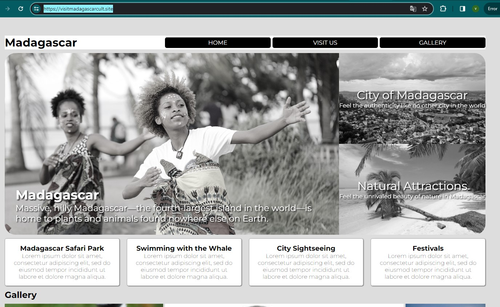

    >Please checkout my assignment at:
    > * https://github.com/RevoU-FSSE-4/module-2-vitoyanufan.git
    > * https://visitmadagascarcult.site/

## Content

   > * Buy Domain in Niagahoster
   > * Signing-in Netlify
   > * Website Auto Deployment Netlify
   > * Custom Domain & DNS

## Buy Domain in Niagahoster

1. Open https://www.niagahoster.co.id/ as Indonesian web hosting services.
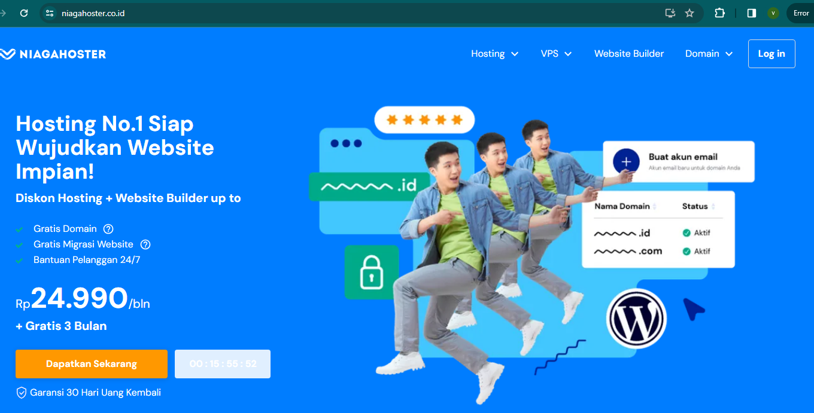

2. Click **Domain** then choose **Cari & Cek Domain**.

3. Type desire website name, in this case **visitmadagascarcult.site**
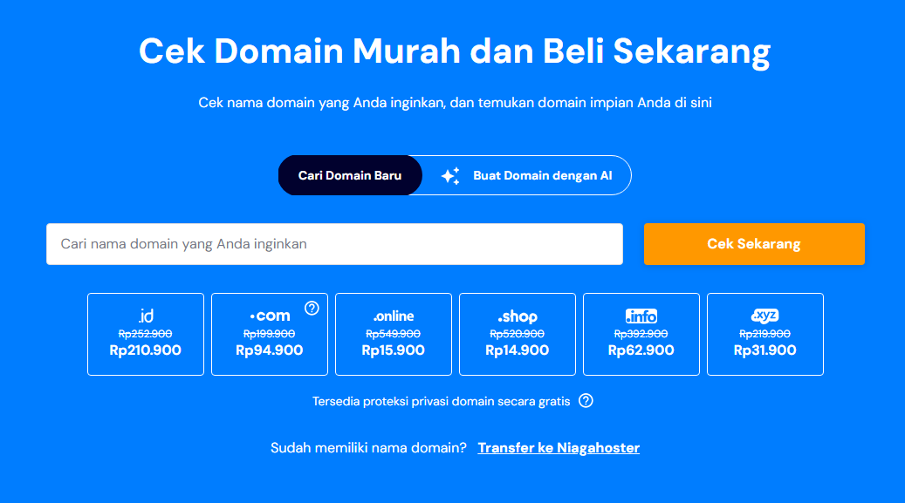

4. If the name approved, continue by choose _.site_ as domain extension.

5. Choose duration services for the domain name (preferably 1 year).

6. Choose payment method then confirm the payment.

7. When domain services is ready, switch to Netlify to configure the website.

## Signing-In Netlify

1. Open netlify at: https://app.netlify.com/

2. Sign-in Netlify using Github.
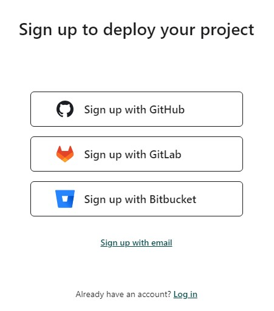

3. Input username, password and credential code that will be sent to your Github email.

## Website Auto deployment Netlify

1. Once logged-in, choose **Sites** as picture below.
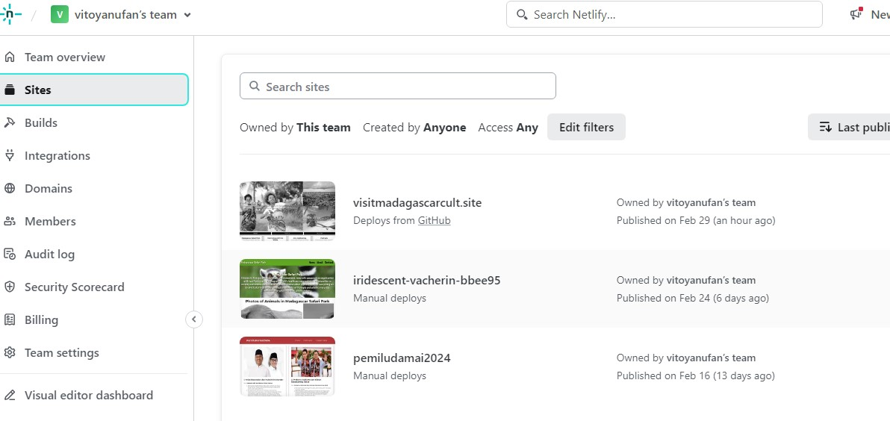

2. Click *Add new site* then *import an existing project*.
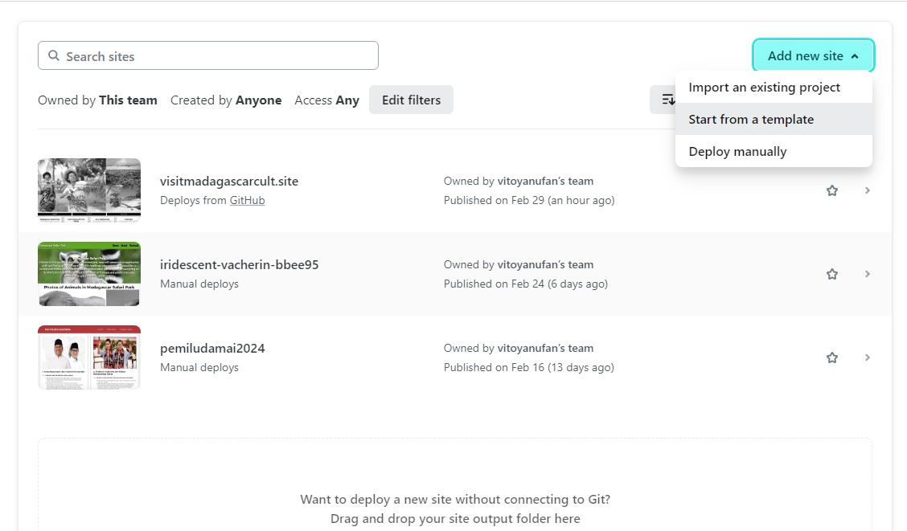

3. Choose deploy with Github.
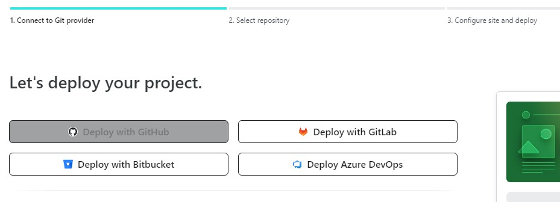

4. Select project in Github repository. Please make sure repository address is correct.
> * https://github.com/RevoU-FSSE-4/module-2-vitoyanufan.git

5. Configure the site setting, especially in this case was the name of the website. (please checkout **Custom Domain & DNS** in section below)

6. When site setting done, click deploy *website*.
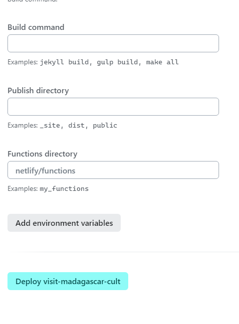

7. Visit Madagascar Cult Site would be auto deployed from Github repository: 
    > https://github.com/RevoU-FSSE-4/module-2-vitoyanufan.git

## Custom Domain and DNS

1. Make sure you have bought domain in Niagahoster and the website ready.

2. Open _domain management_ of Visit Madagascar Cult Site project at Netlify.
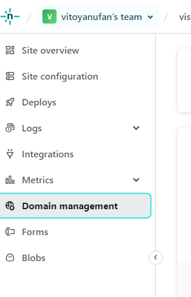

3. Click to add the domain: 
    > Add a domain

4. Type the name of domain at Netlify, then click verify. 
    > visitmadagascarcult.site

5. Search _Name servers_, then copy 4 rows name server in Netlify to Niagahoster DNS:
    > dns1.p05.nsone.net
    > dns2.p05.nsone.net
    > dns3.p05.nsone.net
    > dns4.p05.nsone.net

6. After copy DNS in Netlify, go to Niagahoster Open domain setting.
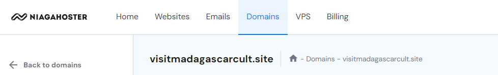

7. Search for _Nameservers_ in Domain Niagahoster, then **paste** the note to Niagahoster name server. Then click **change**.
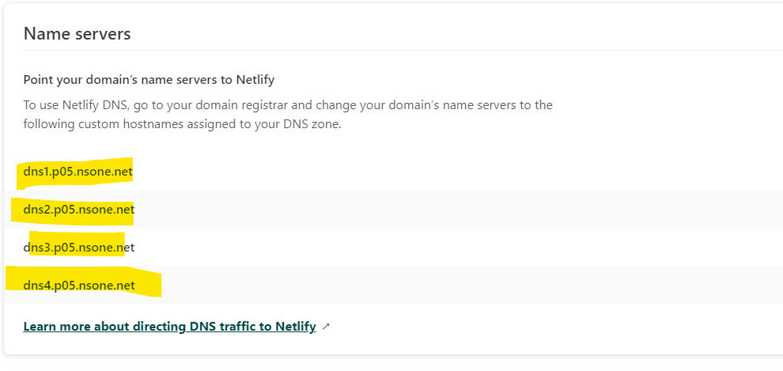
    > dns1.p05.nsone.net
    > dns2.p05.nsone.net
    > dns3.p05.nsone.net
    > dns4.p05.nsone.net

8. Netlify and Niagahoster would take 24 hours to process the domain & DNS customization.

9. Finish.

